# Device Systems - API REST de Gestión de Usuarios

## Descripción

**device_systems** es una API REST desarrollada con FastAPI para la gestión de usuarios. La aplicación permite consultar, filtrar y registrar usuarios mediante endpoints HTTP, aplicando validaciones con Pydantic, parámetros de ruta (Path Parameters), parámetros de consulta (Query Parameters), modelos de respuesta (Response Models) y cabeceras HTTP personalizadas.

## Tecnologías Utilizadas

* Python 3
* FastAPI
* Uvicorn
* Pydantic v2


Instalar dependencias:

```bash
pip install -r requirements.txt
```

## Ejecución del Proyecto

Iniciar el servidor:

```bash
uvicorn app.main:app --reload
```

La aplicación estará disponible en:

```text
http://127.0.0.1:8000
```

Documentación Swagger:

```text
http://127.0.0.1:8000/docs
```

## Estructura del Proyecto

```text
device_systems/
│
├── app/
│   ├── main.py
│   │
│   ├── schemas/
│   │   └── user_schema.py
│   │
│   └── routes/
│       └── user_routes.py
│
├── requirements.txt
└── README.md
```

## Endpoints Disponibles

| Método | Endpoint              | Descripción                |
| ------ | --------------------- | -------------------------- |
| GET    | /users                | Obtiene todos los usuarios |
| GET    | /users/{user_id}      | Obtiene un usuario por ID  |
| GET    | /users?role=admin     | Filtra usuarios por rol    |
| GET    | /users?is_active=true | Filtra usuarios por estado |
| POST   | /users                | Registra un nuevo usuario  |

---

# Evidencias de Funcionamiento

## Captura de Swagger UI


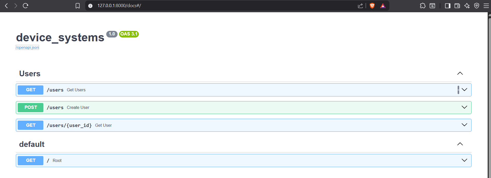

---

## Evidencia GET /users

Solicitud:

```http
GET /users
```

Resultado esperado:

```json
[
  {
    "id": 1,
    "name": "Juan Perez",
    "email": "juan@test.com",
    "role": "admin",
    "is_active": true
  }
]
```

Captura:

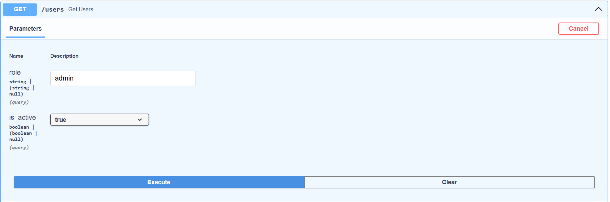
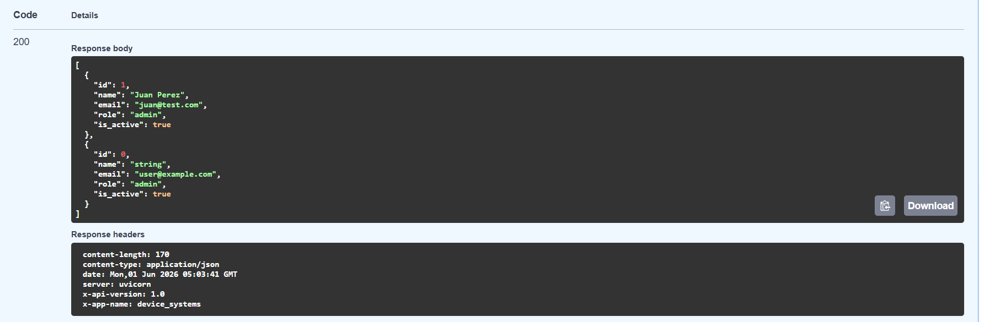

---

## Evidencia GET /users/{user_id}

Solicitud:

```http
GET /users/1
```

Resultado esperado:

```json
{
  "id": 1,
  "name": "Juan Perez",
  "email": "juan@test.com",
  "role": "admin",
  "is_active": true
}
```

Captura:

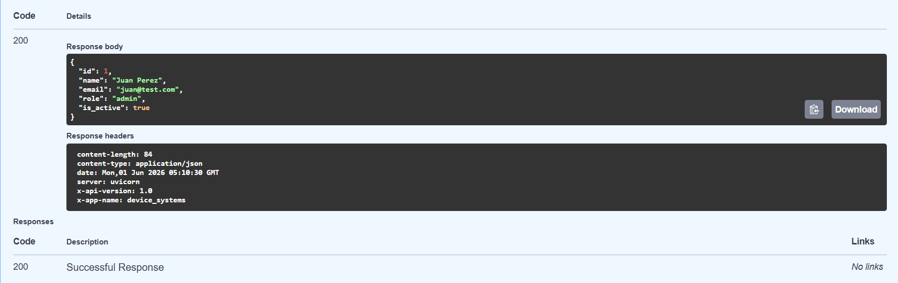

---

## Evidencia POST /users

Solicitud:

```json
{
  "id": 3,
  "name": "Carlos Ruiz",
  "email": "carlos@test.com",
  "role": "support",
  "is_active": true
}
```

Respuesta:

```json
{
  "id": 3,
  "name": "Carlos Ruiz",
  "email": "carlos@test.com",
  "role": "support",
  "is_active": true
}
```

Captura:

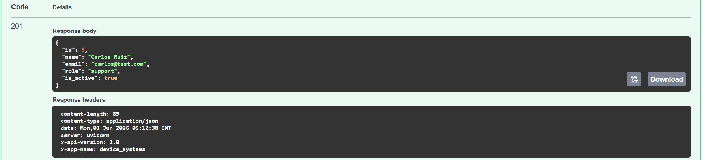

---

# Evidencia de Validaciones y Errores

## Error por correo duplicado

Solicitud:

```json
{
  "id": 4,
  "name": "Pedro Lopez",
  "email": "juan@test.com",
  "role": "user",
  "is_active": true
}
```

Respuesta:

```json
{
  "detail": "Email already exists"
}
```

Captura:

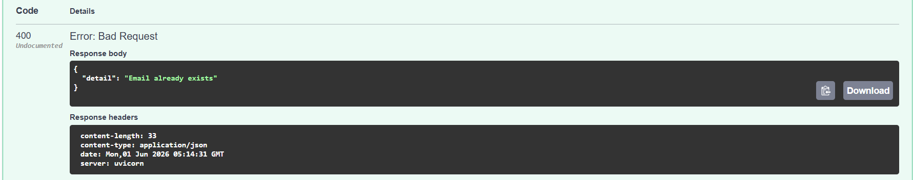

---

## Error por nombre inválido

Solicitud:

```json
{
  "id": 5,
  "name": "AB",
  "email": "ab@test.com",
  "role": "user",
  "is_active": true
}
```

Respuesta:

```json
{
  "detail": [
    {
      "type": "string_too_short"
    }
  ]
}
```

Captura:

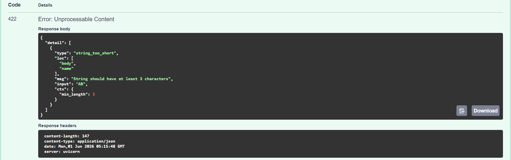

---

## Error por correo inválido

Solicitud:

```json
{
  "id": 6,
  "name": "Pedro Perez",
  "email": "correo_invalido",
  "role": "user",
  "is_active": true
}
```

Respuesta:

```json
{
  "detail": [
    {
      "type": "value_error"
    }
  ]
}
```

Captura:

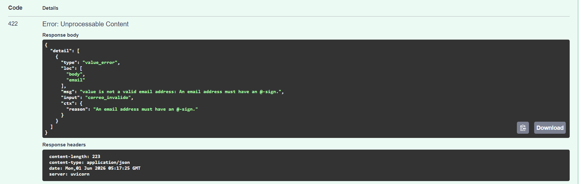

---

## Error por rol inválido

Solicitud:

```json
{
  "id": 7,
  "name": "Pedro Perez",
  "email": "pedro@test.com",
  "role": "manager",
  "is_active": true
}
```

Respuesta:

```json
{
  "detail": [
    {
      "type": "literal_error"
    }
  ]
}
```

Captura:

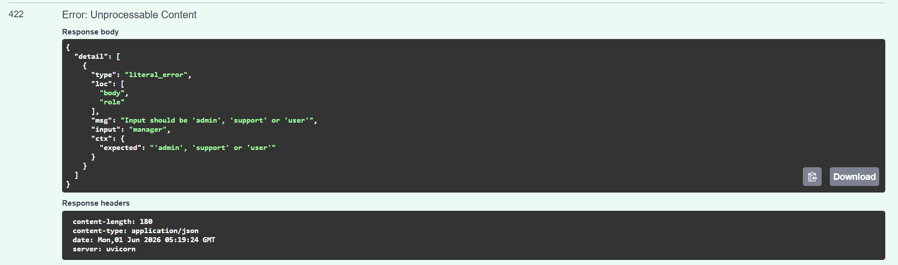

---

# Cabeceras HTTP Personalizadas

La API incluye las siguientes cabeceras en las respuestas:

```http
X-App-Name: device_systems
X-API-Version: 1.0
```

Estas cabeceras permiten identificar la aplicación y la versión de la API.

---

# Reflexión sobre el Uso de FastAPI para Construir APIs REST

Durante el desarrollo de esta actividad aprendí que FastAPI es un framework moderno que facilita la creación de APIs REST de forma rápida y organizada. Una de sus principales ventajas es la integración con Pydantic, que permite validar automáticamente los datos recibidos y reducir errores en la aplicación.

También comprendí la importancia de utilizar métodos HTTP adecuados, parámetros de ruta y parámetros de consulta para construir servicios más flexibles. La documentación automática generada mediante Swagger UI facilita las pruebas y la comprensión de los endpoints sin necesidad de herramientas adicionales.

Finalmente, esta práctica me permitió fortalecer conceptos relacionados con el desarrollo backend, validación de información, manejo de respuestas HTTP y diseño de servicios REST, competencias fundamentales para el desarrollo de aplicaciones modernas.

# Link Video

https://youtu.be/mDLfxfS1LoA


# EVO 8
## Descripción

device_systems es una API REST desarrollada con FastAPI para la gestión de usuarios.

La aplicación permite:

- Crear usuarios.
- Listar usuarios.
- Consultar usuarios por ID.
- Filtrar usuarios por rol y estado.
- Actualizar usuarios completamente mediante PUT.
- Actualizar usuarios parcialmente mediante PATCH.
- Eliminar usuarios mediante DELETE.

Además, implementa validaciones con Pydantic, manejo de errores con HTTPException, códigos de estado HTTP adecuados, Dependency Injection mediante Depends() y documentación automática con Swagger/OpenAPI.


---

## Explicación de la Estructura

### routes
Contiene los endpoints de la API.

### schemas
Contiene los modelos Pydantic utilizados para validar la información de entrada y salida.

### services
Contiene la lógica de negocio del recurso users.

### dependencies
Contiene funciones reutilizables implementadas mediante Dependency Injection utilizando Depends().

### data
Simula una base de datos en memoria mediante una lista de usuarios.

## Endpoints Disponibles

| Método | Endpoint | Descripción |
|----------|----------|----------|
| GET | /users | Obtener todos los usuarios |
| GET | /users/{user_id} | Obtener usuario por ID |
| GET | /users?role=admin | Filtrar por rol |
| GET | /users?is_active=true | Filtrar por estado |
| POST | /users | Crear usuario |
| PUT | /users/{user_id} | Actualizar usuario completamente |
| PATCH | /users/{user_id} | Actualizar parcialmente un usuario |
| DELETE | /users/{user_id} | Eliminar usuario |

## Uso de Dependency Injection

Se implementó Dependency Injection mediante Depends() para reutilizar lógica común dentro de la aplicación.

La función get_user_or_404() se utiliza para buscar un usuario por su identificador. Si el usuario existe, se devuelve el objeto correspondiente; de lo contrario, se genera una excepción HTTP 404.

Gracias a Depends(), esta lógica puede reutilizarse en diferentes endpoints sin duplicar código.

## Manejo de Errores

La API implementa manejo de errores mediante HTTPException.

Errores controlados:

- Usuario no encontrado.
- Correo electrónico duplicado.
- Actualización parcial sin datos.
- Eliminación de usuario inexistente.
- Validaciones automáticas mediante Pydantic.

Ejemplo:


{
  "detail": "User not found"
}


---

## 11. Agregar evidencias nuevas

La guía pide capturas adicionales.


# Evidencias de Funcionamiento

## Swagger UI

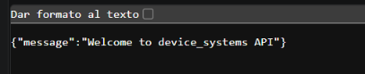

## ReDoc

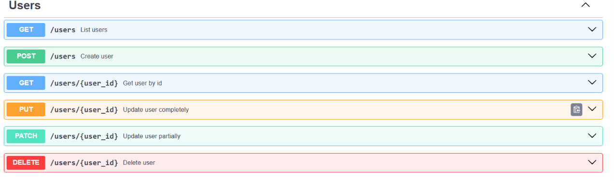


## PUT /users/{user_id}

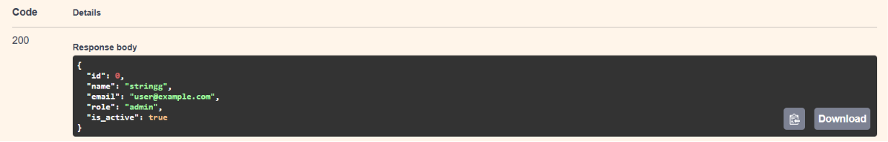

## PATCH /users/{user_id}

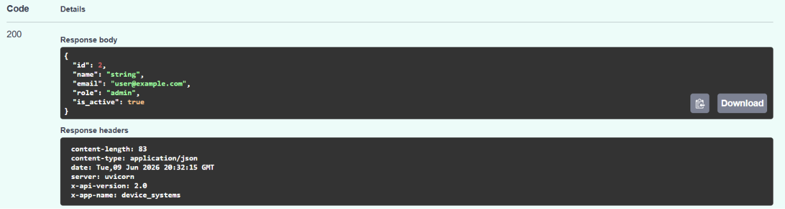

## DELETE /users/{user_id}

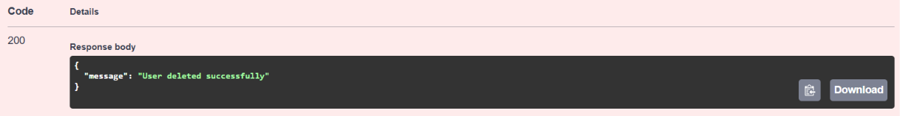

## Consola

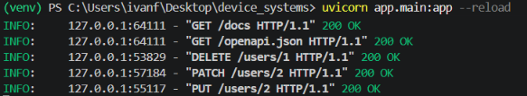

# Reflexión Final

Durante esta actividad comprendí cómo una API REST puede evolucionar desde operaciones básicas de consulta y creación hacia una solución más completa y profesional.

Aprendí a implementar operaciones de actualización y eliminación mediante los métodos PUT, PATCH y DELETE, así como a utilizar códigos de estado HTTP adecuados para cada situación. También entendí la importancia del manejo de errores mediante HTTPException para proporcionar respuestas claras a los clientes de la API.

Otro aspecto importante fue el uso de Dependency Injection mediante Depends(), que permite reutilizar lógica y mejorar la organización del código. Finalmente, la documentación automática generada por Swagger UI y ReDoc facilitó la prueba y comprensión de todos los endpoints implementados.

Esta actividad fortaleció mis conocimientos sobre FastAPI, diseño de APIs REST y buenas prácticas de desarrollo backend.

# Link Video 2

https://youtu.be/lHaWwOxL5ro

# EVO9


## Descripción

device_systems es una API REST desarrollada con FastAPI para la gestión de usuarios.

En esta versión se incorporó persistencia de datos mediante SQLAlchemy y SQLite, permitiendo almacenar, consultar, actualizar y eliminar usuarios directamente desde una base de datos relacional.

La API implementa operaciones CRUD completas, validaciones con Pydantic, manejo de errores mediante HTTPException y documentación automática con Swagger/OpenAPI.

---

## Tecnologías utilizadas

- Python 3
- FastAPI
- Uvicorn
- SQLAlchemy
- Pydantic v2
- SQLite
- Swagger UI
- ReDoc

---

## Estructura del proyecto

```text
device_systems/
│
├── app/
│   ├── database/
│   │   └── connection.py
│   │
│   ├── dependencies/
│   │   └── database_dependency.py
│   │
│   ├── models/
│   │   └── user_model.py
│   │
│   ├── routes/
│   │   └── user_routes.py
│   │
│   ├── schemas/
│   │   └── user_schema.py
│   │
│   ├── services/
│   │   └── user_service.py
│   │
│   └── main.py
│
├── device_systems.db
├── requirements.txt
└── README.md
```

### Evidencia de la estructura del proyecto

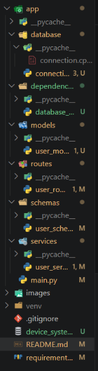


Instalar dependencias:

```bash
pip install -r requirements.txt
```

---

## Ejecución

Iniciar servidor:

```bash
uvicorn app.main:app --reload
```

Servidor:

```text
http://127.0.0.1:8000
```

Swagger UI:

```text
http://127.0.0.1:8000/docs
```

ReDoc:

```text
http://127.0.0.1:8000/redoc
```

---

## Base de datos

La aplicación utiliza SQLite para almacenar los usuarios.

Archivo generado:

```text
device_systems.db
```

### Evidencia de la base de datos

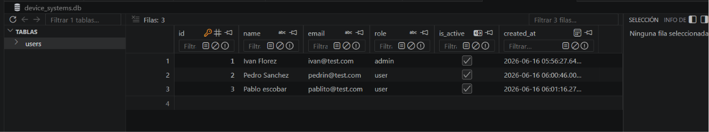


---

# Endpoints

| Método | Endpoint | Descripción |
|----------|----------|----------|
| GET | /users | Listar usuarios |
| GET | /users/{id} | Obtener usuario por ID |
| POST | /users | Crear usuario |
| PUT | /users/{id} | Actualizar usuario completo |
| PATCH | /users/{id} | Actualizar usuario parcialmente |
| DELETE | /users/{id} | Eliminar usuario |

---

# Ejemplos de uso

## Crear usuario

### Request

POST /users

```json
{
  "name": "Ivan Florez",
  "email": "ivan@test.com",
  "role": "admin",
  "is_active": true
}
```

### Response

```json
{
  "id": 1,
  "name": "Ivan Florez",
  "email": "ivan@test.com",
  "role": "admin",
  "is_active": true,
  "created_at": "2026-06-16T00:00:00"
}
```

### Evidencia

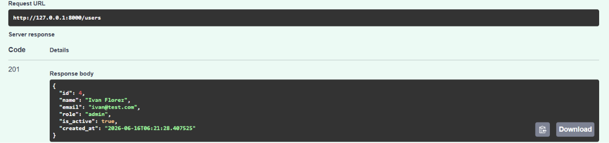


---

## Listar usuarios

GET /users

### Evidencia

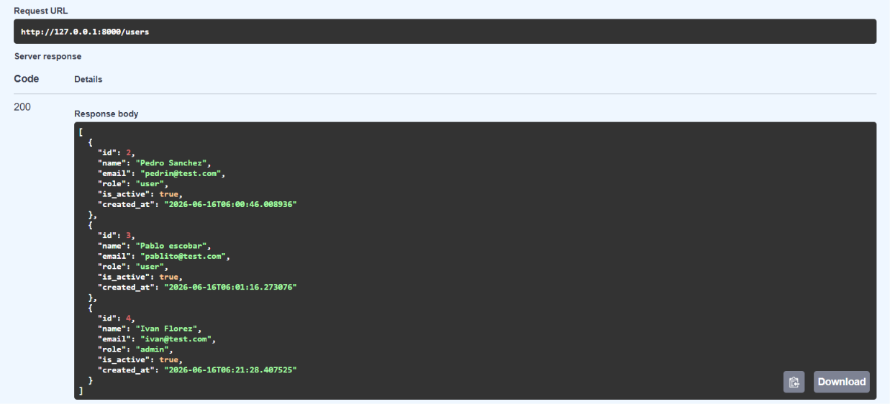

---

## Consultar usuario por ID

GET /users/2

### Evidencia

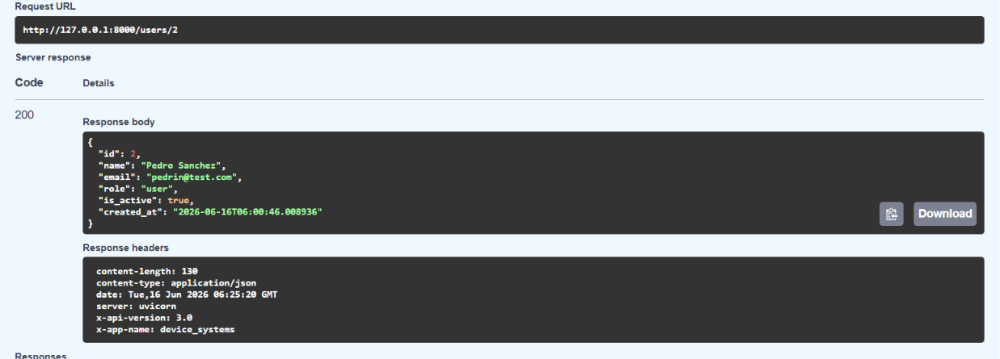

---

## Actualizar usuario completo

PUT /users/3

### Evidencia

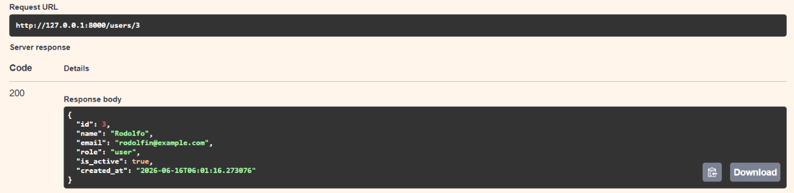


---

## Actualizar usuario parcialmente

PATCH /users/2

### Evidencia

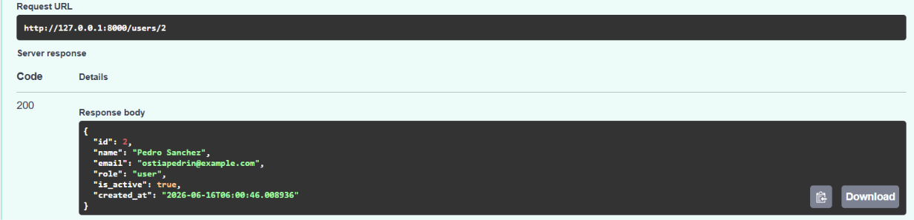


---

## Eliminar usuario

DELETE /users/1

### Evidencia

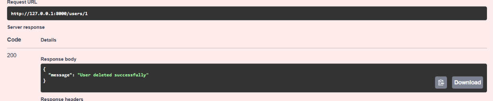

---

# Validaciones y errores controlados

## Email duplicado

Código:

```text
400 Bad Request
```

Respuesta:

```json
{
  "detail": "Email already exists"
}
```

### Evidencia

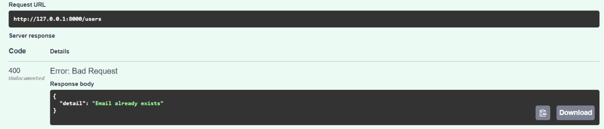


---

## Usuario no encontrado

Código:

```text
404 Not Found
```

Respuesta:

```json
{
  "detail": "User not found"
}
```

### Evidencia

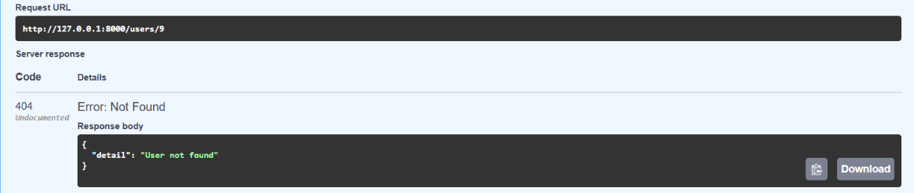


---

## Error de validación

Código:

```text
422 Unprocessable Entity
```

Ejemplo:

```json
{
  "name": "Juan",
  "email": "correo-invalido",
  "role": "admin",
  "is_active": true
}
```

### Evidencia

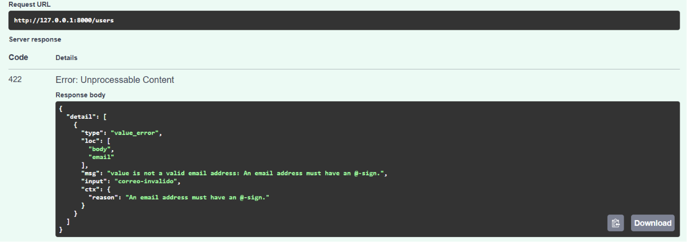


---

# Diferencia entre modelo SQLAlchemy y schema Pydantic

## Modelo SQLAlchemy

El modelo SQLAlchemy representa la estructura de la tabla en la base de datos y permite realizar operaciones CRUD mediante el ORM.

Ejemplo:

```python
class User(Base):
```

Funciones principales:

- Crear tablas.
- Definir columnas.
- Aplicar restricciones.
- Realizar consultas.

## Schema Pydantic

Los schemas Pydantic validan la información que recibe y devuelve la API.

Ejemplo:

```python
class UserCreate(BaseModel):
```

Funciones principales:

- Validar datos.
- Validar correos electrónicos.
- Controlar formatos.
- Definir respuestas de la API.

---

# Swagger y ReDoc

FastAPI genera automáticamente la documentación de la API.

### Swagger UI

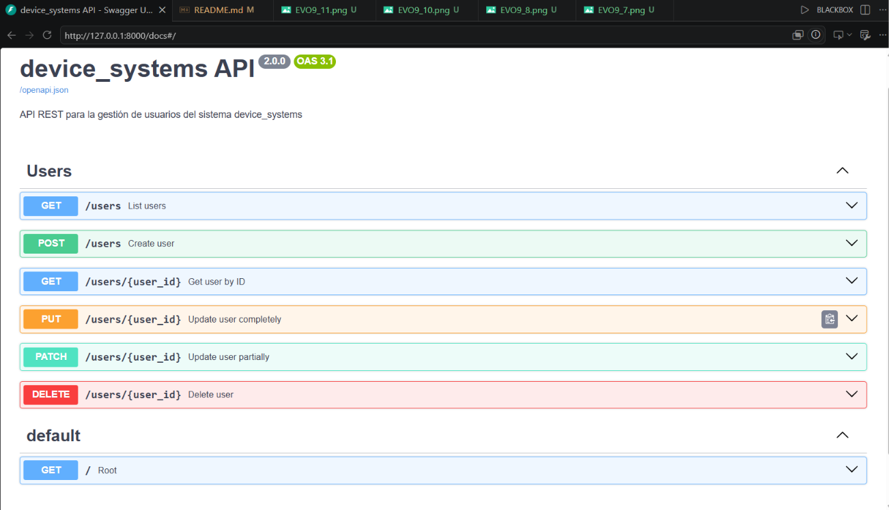


### ReDoc

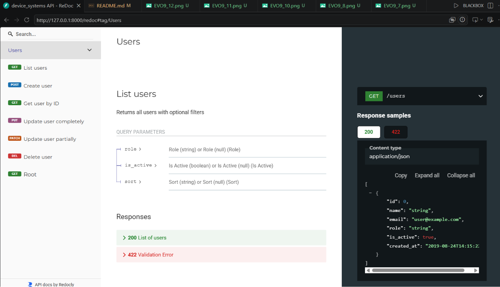


---

# Reflexión final

Durante el desarrollo de esta actividad se evolucionó la API device_systems desde una implementación basada en estructuras de datos en memoria hacia una solución con persistencia real utilizando SQLAlchemy y SQLite.

La integración de SQLAlchemy permitió comprender el uso de ORM para trabajar con bases de datos relacionales desde Python, facilitando la creación de modelos, consultas y operaciones CRUD. Asimismo, el uso de schemas Pydantic ayudó a validar la información de entrada y salida de la API, mejorando la calidad y seguridad de los datos.

Finalmente, esta actividad permitió entender la importancia de la persistencia de datos en aplicaciones backend, así como la utilidad de FastAPI para construir APIs REST modernas, escalables y bien documentadas.


# Link video 3

https://youtu.be/epdIPZ_sSco


## EV10

# device_systems - EV10 FastAPI Avanzado


## Descripción del proyecto

Este proyecto corresponde a la evolución de la API `device_systems`, en la cual se implementan migraciones con Alembic, relaciones entre modelos (User, Device y Loan) y consultas avanzadas con joins y filtros. El sistema permite gestionar usuarios, dispositivos tecnológicos y préstamos de forma estructurada y escalable.

---

## Tecnologías utilizadas

- FastAPI
- SQLAlchemy
- Alembic
- MySQL
- Pydantic
- Swagger 

---

## Migraciones con Alembic

### Inicialización de Alembic
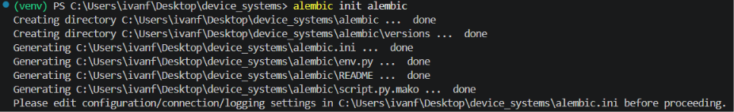
- alembic init alembic

### Creación de migración automática
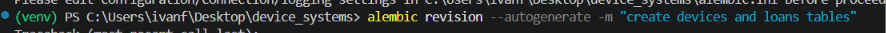
- alembic revision --autogenerate -m "create devices and loans tables"

### Aplicación de migraciones
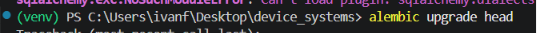
- alembic upgrade head

### Historial de migraciones
- alembic history

---

## Estructura de base de datos

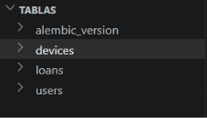

- users
- devices
- loans

---

## Documentación API (Swagger)

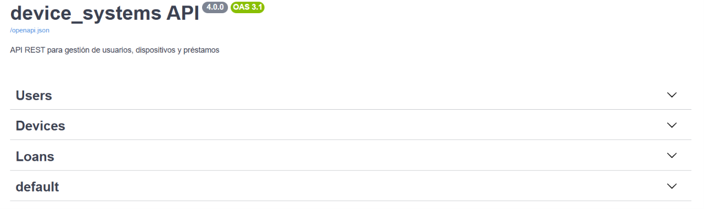

- Users
- Devices
- Loans

---


Reflexión

La implementación de Alembic permitió gestionar cambios en la base de datos de forma controlada, asegurando la integridad de la información.

El uso de relaciones entre modelos facilitó la representación de escenarios reales como préstamos de dispositivos a usuarios.

Las consultas con joins y filtros avanzados mejoraron la capacidad de análisis de la información, permitiendo obtener datos combinados de múltiples tablas de forma eficiente.

Este proyecto demuestra la importancia de construir APIs escalables, mantenibles y basadas en buenas prácticas de desarrollo backend.
